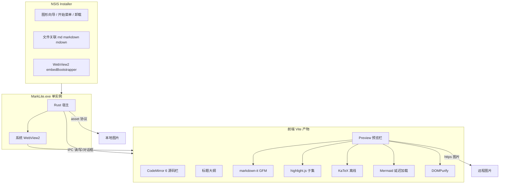
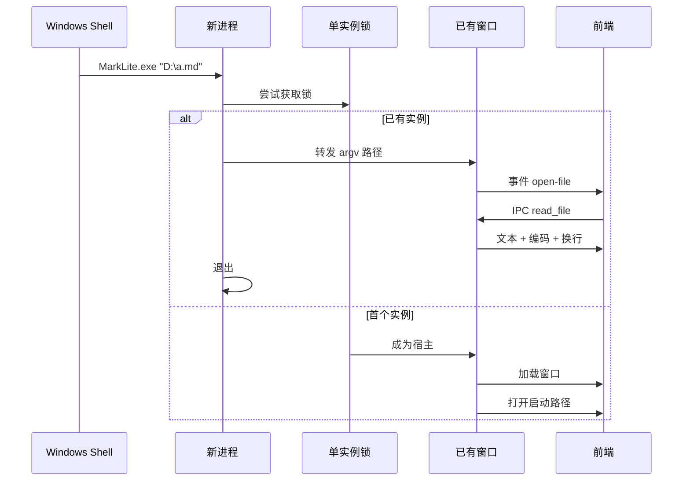
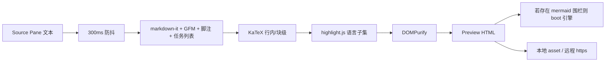

# MarkLite 技术设计规格

Feature Name: offline-markdown-desktop
Updated: 2026-09-03

## Description

MarkLite 是仅面向 Windows 10/11 的 Markdown 桌面阅读/轻编辑器。安装后通过文件关联双击打开 `.md` / `.markdown` / `.mdown`；窗口为源码栏 + 预览栏分栏；预览离线覆盖 GFM、代码高亮、KaTeX 公式与 Mermaid 图表。渲染使用系统 WebView2，安装包不内嵌浏览器内核。有网时默认加载远程图片。NSIS 安装到当前用户。本版本不检查应用更新，不提供「新建」空白文档。

本设计覆盖 `requirements.md` Requirement 1–18。权威数据始终是源码栏中的原始字符串；预览只读渲染，保存只写源码栏文本。

## Architecture

### 总体结构



### 启动与单实例



### 预览管线



### 设计决策与理由

| 决策 | 选择 | 理由 |
|---|---|---|
| 应用框架 | Tauri 2 + Rust | 系统 WebView2，exe 约 2–4 MB；文件 I/O 与安全边界在 Rust |
| Windows 打包 | NSIS | 正规安装向导、开始菜单、卸载、文件关联；体积小于 MSI |
| WebView2 缺失 | `embedBootstrapper` | 安装包多约 1–2 MB；缺失时跑官方引导，满足 Req 2.4 且不内嵌 100MB+ 运行时 |
| 前端框架 | Svelte 5 + Vite | 编译后接近原生 DOM，比 React/Vue 更小 |
| 源码编辑器 | CodeMirror 6 | 行号、Markdown 着色、虚拟滚动；Monaco 过大 |
| Markdown 解析 | markdown-it + GFM 插件 | 生态成熟，脚注/任务列表有现成插件 |
| 代码高亮 | highlight.js 按语言注册 | 只打 12 种语言，避免 Shiki 的 WASM/主题包 |
| 公式 | KaTeX 全套离线字体 | 比 MathJax 小，同步渲染 |
| 图表 | mermaid.min.js 延迟加载 | 体积最大头；无 `mermaid` 围栏时不解析该脚本 |
| HTML 净化 | DOMPurify | 满足 Req 15 脚本/事件属性/javascript URL |
| 本地图 | Tauri asset protocol | 禁止 `file://`；Rust 做目录越界检查 |
| 单实例 | `tauri-plugin-single-instance` | 把后续 argv 交给已有窗口 |
| 安装范围 | NSIS `currentUser` | 无需管理员即可关联当前用户的 `.md` |
| 换行策略 | 打开时检测，保存时按原风格写回 | 避免无编辑保存也改 `\r\n` |
| 自动更新 | 本版本不做 | 无 Manifest、无 updater 插件 |
| 新建文档 | 本版本不做 | 空工作区只有「打开文件」 |

**明确不采用**

- Electron / 固定版 WebView2：安装包 80MB+，与 Req 1.4 冲突
- Monaco、Shiki、整包 highlight.js：体积与启动成本过高
- Typora 式预览回写：与 Req 5.6、Out of Scope 冲突
- 前端直接 `std::fs` 等价物：所有路径读写走 Rust 命令

## Components and Interfaces

### 仓库布局

```
/workspace
  src-tauri/                 Rust 宿主
    src/main.rs              入口、单实例、插件注册
    src/commands/            IPC 命令
    src/fs_safe.rs           路径规范化与越界检查
    src/encoding.rs          UTF-8 / BOM / GBK
    capabilities/default.json
    tauri.conf.json
    windows/hooks.nsh        NSIS：中文提示、WebView2 引导文案
  src/                       Svelte 前端
    App.svelte               窗口壳：菜单、标签、分栏、状态栏
    lib/editor.ts            CodeMirror 装配
    lib/preview.ts           渲染管线
    lib/sync-scroll.ts       标题锚点同步滚动
    lib/toc.ts               大纲
    vendor/                  离线 KaTeX / mermaid.min.js / hljs 语言
  samples/kitchen-sink.md    验收样例
```

### C1 Rust 宿主

职责：进程生命周期、窗口、IPC、文件、asset 协议作用域。

插件：

- `tauri-plugin-single-instance`
- `tauri-plugin-dialog`

窗口：`PerMonitorV2` DPI；标题「MarkLite — 文件名」；Dirty 时文件名前加 `*`。

### C2 IPC 命令

前端只调用下列命令。路径参数一律先 `dunce::canonicalize`（路径不存在时用父目录 canonicalize + 文件名拼接）。

| 命令 | 入参 | 出参 | 对应需求 |
|---|---|---|---|
| `read_file` | `{ path }` | `{ text, encoding, bom, newline, size }` | R3, R6, R16 |
| `write_file` | `{ path, text, bom, newline }` | `{ ok }` | R6 |
| `pick_open` | 无 | `{ paths: string[] }` | R4 |
| `pick_save` | `{ defaultPath }` | `{ path }` | R6 |
| `set_asset_root` | `{ dir }` | `{ ok }` | R11 |
| `get_config` / `set_config` | 配置片段 | 配置 | R11.5, R14.4 |

能力白名单（`capabilities/default.json`）仅授予上表命令；`fs` 默认权限关闭，文件访问只经自写命令。

`read_file` 规则：

1. 扩展名属于 `{md, markdown, mdown}`（大小写不敏感），或由用户在保存对话框显式选择的路径。
2. `size > 10 MiB` 时返回 `FileTooLarge`，由前端询问是否只读纯文本打开（此时跳过高亮/KaTeX/Mermaid）。
3. 解码见数据模型「编码」。

`write_file` 规则：写入临时文件 `path + ".marklite.tmp"` 后 `rename` 替换；失败时保留源码栏 Dirty。

### C3 前端壳

- 顶栏：文件 / 编辑 / 视图 / 帮助；简体中文。
- 标签栏：文件名 + Dirty 点；Ctrl+W / Ctrl+Tab。
- 左：可选 TOC；中：Source Pane；右：Preview Pane；分隔条 20%–80%。
- 底栏：完整路径（中间省略）、编码、字数。
- 快捷键与 R14.5 一致；查找 UI 为 Source Pane 内浮层，区分大小写开关。

空工作区：无标签时显示「打开文件」主按钮，接受拖放。

### C4 源码栏（CodeMirror 6）

- `@codemirror/lang-markdown` + 行号 + 等宽字体链：`Cascadia Code, Consolas, Microsoft YaHei Mono, monospace`。
- `EditorView.updateListener` 在文档变更时标记 Dirty，并触发 300ms 防抖预览。
- 文件 > 2 MiB 启用默认虚拟化（CodeMirror 自带）；> 10 MiB 只读纯文本模式关闭 Markdown 语言包。
- 查找使用 `@codemirror/search`。

### C5 预览管线

顺序固定，禁止反向把 HTML 写回源码。

1. **markdown-it** 启用 `html: true`（随后净化）、`linkify: true`、`typographer: false`（避免改写源码语义字符）。
2. 插件：`markdown-it-anchor`（slug 与 TOC/同步滚动共用）、`markdown-it-footnote`、`markdown-it-task-lists`、GFM 表格（markdown-it 默认 + `breaks` 关闭，换行按 GFM）。
3. **数学**：`markdown-it-texmath` 或等价插件，分隔符 `$...$` / `$$...$$`；KaTeX `throwOnError: false`，失败时输出原 TeX + 错误类名。
4. **高亮**：`highlight.js` 仅 `registerLanguage`：`bash, javascript, typescript, json, python, go, rust, xml(html), css, yaml, sql, markdown`。语言别名 `js→javascript`、`ts→typescript`。未注册语言走纯文本。
5. **DOMPurify**：`ALLOWED_URI_REGEXP` 允许 `http/https/data/asset`；禁止 `javascript:`；去掉事件属性与 `<script>`/`<iframe>`（Mermaid 宿主 iframe 由管线在净化之后插入，不经过用户 HTML）。
6. **Mermaid**：扫描净化后 HTML 中 `language-mermaid` 代码块；首次命中再 `import('./vendor/mermaid.min.js')`。`securityLevel: 'strict'`，`startOnLoad: false`。单图 `Promise.race` 3 秒超时，失败显示源码 + 错误。
7. **图片**：相对路径改写为 `asset://localhost/<encoded>`；`http(s):` 保留。配置 `blockRemoteImages=true` 时替换为占位。
8. **主题**：预览 CSS 两套（浅/深），跟随 `prefers-color-scheme` 与 Windows 主题；hljs / KaTeX / Mermaid 主题同步切换。

### C6 同步滚动与 TOC

- 源码侧按 ATX/Setext 标题切块，预览侧用 `markdown-it-anchor` 的 `id`。
- 滚动时取源码可视区第一个标题，将预览 `scrollIntoView` 到对应 `id`；反向同样。用 `flags.syncing` 防止回声。
- TOC 由同一标题列表生成，点击同时滚动两侧。

### C7 本地图片 asset 协议

- `app.security.assetProtocol.enable = true`。
- 每次切换 Active Document 调用 `set_asset_root`，把 scope 设为该文件父目录（含子目录 `**`）。
- Rust 在自定义转换中：`canonicalize(root)` + `canonicalize(target)`，`target.starts_with(root)` 才允许读。越界返回占位。
- 允许扩展名：`png jpg jpeg gif webp svg`。

### C8 安全与 CSP

`tauri.conf.json` CSP（概念值）：

- `default-src 'self'`
- `script-src 'self'`
- `style-src 'self' 'unsafe-inline'`（KaTeX/hljs 需要内联样式）
- `font-src 'self'`
- `img-src 'self' asset: http://asset.localhost https: http: data: blob:`
- `connect-src ipc: http://ipc.localhost`（Mermaid 不发起网络；远程图走 `img-src`）
- `frame-src 'self'`
- `object-src 'none'`
- `base-uri 'none'`

远程脚本、远程样式一律不在 CSP 放行。Remote Image 只走 `img-src`。

### C9 安装包与文件关联

`tauri.conf.json` 要点：

```json
{
  "bundle": {
    "targets": ["nsis"],
    "fileAssociations": [
      { "ext": ["md", "markdown", "mdown"], "mimeType": "text/markdown", "name": "Markdown", "role": "Editor" }
    ],
    "windows": {
      "webviewInstallMode": { "type": "embedBootstrapper" },
      "nsis": {
        "installMode": "currentUser",
        "displayLanguageSelector": false,
        "installerHooks": "./windows/hooks.nsh"
      }
    }
  }
}
```

`hooks.nsh`：安装结束时若检测不到 WebView2，弹出简体中文说明并打开 Microsoft 官方 WebView2 说明/下载页。卸载时清除本安装程序写入的 ProgID 与扩展名绑定。

安装模式 **currentUser**（已确认）：无需管理员即可关联当前用户的 `.md`。无代码签名证书时仍出未签名 NSIS，发布说明按 R18.2 写明 SmartScreen。

本版本不包含自动更新插件、不生成 updater artifact。

### C10 配置落盘

路径：`%APPDATA%\com.marklite.app\config.json`

字段：窗口 x/y/w/h/maximized、分栏比例、TOC 是否展开、`blockRemoteImages`。启动恢复窗口几何；位置不在任何显示器工作区则主屏居中。启动不自动重开上次文件，避免与双击关联抢焦点。

## Data Models

### DocumentTab

```text
id: string
path: string
title: string
text: string
encoding: "utf-8" | "gbk"
bom: bool
newline: "lf" | "crlf"
dirty: bool
size: u64
readonlyPlain: bool
```

- `path` 必填：只打开磁盘上已有文件，不存在未命名标签。
- 同一规范化路径只允许一个标签（R3.5）。

### ReadFileResult / WriteFileRequest

与 IPC 表对应。`text` 为 Unicode 字符串，内存中统一 `\n`；写回时按 `newline` 展开。

### 编码算法

1. 若以 `EF BB BF` 开头 → UTF-8 BOM，`bom=true`
2. 否则尝试 UTF-8 严格解码
3. 失败则 `encoding_rs::GBK`；成功则状态栏「已按 GBK 打开，保存将写 UTF-8」
4. 仍失败 → 返回 `BinaryOrUnknown`，拒绝打开

保存：UTF-8；`bom` 仅当打开时为 true 才写 BOM。GBK 打开后按 R6.4 写 UTF-8。

### Config

```text
window: { x, y, w, h, maximized }
splitRatio: number          # 0.20–0.80
tocVisible: bool
blockRemoteImages: bool     # 默认 false
```

## Correctness Properties

1. **源码权威**：任意预览步骤不修改 `DocumentTab.text`。打开后不编辑再保存，正文 Markdown 标记与打开时一致；仅允许按已记录的 `newline` 写回（若打开为 CRLF 则写 CRLF）。
2. **单实例**：任意时刻最多一个 MarkLite 持有锁；第二次启动把路径交给前者后退出。
3. **路径安全**：`read_file` / `write_file` / asset 读取的目标在 canonicalize 后，或为用户对话框返回的绝对路径，或位于当前 `asset_root` 之下。
4. **离线渲染**：断网时 GFM、高亮、KaTeX、Mermaid、Local Image 不发起网络请求即可完成（Remote Image 失败走占位）。
5. **脚本隔离**：用户文档中的 `<script>`、事件属性、`javascript:` 在 Preview 中不执行。
6. **Dirty 守恒**：`text !== lastSavedText` 当且仅当 `dirty == true`；保存成功后两者相等。
7. **Mermaid 懒加载**：所有标签源码均无 `mermaid` 围栏时，不执行 mermaid 脚本解析。
8. **无未命名标签**：每个打开的标签都对应一个已存在的磁盘路径。
9. **大文件**：`size > 10 MiB` 未经用户确认不以完整预览模式打开。

## Error Handling

| 场景 | 系统行为 |
|---|---|
| 启动路径不存在 / 无读权限 | 中文对话框含文件名；窗口留空工作区或保持已有标签 |
| UTF-8 与 GBK 均失败 | 拒绝打开，提示「无法识别为文本」 |
| 保存失败（只读、磁盘满、占用） | 提示原因；Dirty 保持 |
| 相对图片越界或缺失 | 预览占位 + 路径说明 |
| 远程图 超时/4xx/5xx/断网 | 损坏图占位，其余继续 |
| 公式解析失败 | 该处显示原 TeX + 简短错误 |
| Mermaid 解析失败或 >3s | 该块显示源码 + 错误 |
| WebView2 缺失（运行时） | 窗口显示中文说明 + 官方安装链接；功能不可用直到装好 |
| 单图渲染卡住 | 超时降级，Source Pane 可滚动、可切标签 |

错误文案一律简体中文，含对象名或代码块起始行号（R17.3）。可恢复错误不影响其它标签（R17.4）。

关闭 Dirty 标签：保存 / 不保存 / 取消。关窗口：对每个 Dirty 标签询问，取消则中止关闭。

## Test Strategy

### 样例文档

`samples/kitchen-sink.md` 必须同时含：ATX/Setext 标题、表格、任务列表、删除线、自动链接、脚注、12 种高亮语言各一、行内/块级公式、mermaid 流程图、相对路径 png、一枚 `https` 图、一枚含 `<script>alert(1)</script>` 的 HTML 片段、一枚 `javascript:alert(1)` 链接。

### 自动化（CI 可跑部分）

- Rust：`fs_safe` 越界用例（`..\`、junction、不同盘符）；编码 BOM/GBK/UTF-8；`newline` 往返。
- 前端单测：markdown 管线快照（GFM 子集）；DOMPurify 后无 `script`/on\*；mermaid 懒加载开关。
- 体积预算：release 产物 + NSIS 压缩后大小写入日志，与 8–18 MB 预期比较（允许 20% 偏差）。

### 手工验收（对应需求）

| 用例 | 需求 |
|---|---|
| 全新 Win10 21H2 已有 WebView2：安装 → 双击 md 打开 → 分栏改 → Ctrl+S | R1–R6 |
| 同一环境断网打开 kitchen-sink：GFM/高亮/公式/图/本地图正确；远程图占位 | R7–R11 |
| 无 WebView2 环境跑安装包：出现引导/官方入口 | R2.4 |
| 已开窗口再双击另一文件：新标签、仍一进程 | R3 |
| 恶意 HTML 不弹窗、不执行 | R15 |
| 10 MiB 文本可滚动，主界面可关 | R16 |
| 卸载后关联清除 | R2.5 |
| 空工作区只有「打开文件」，无新建入口 | R3.3 |

### 性能参考机

SSD、已就绪 WebView2、Win10 21H2 x64。2 MiB 文档 Source Pane 可见 < 2s。

## Release 体积预算

| 部分 | 压缩后约 |
|---|---|
| Rust/Tauri exe（LTO, opt-level=z, strip） | 2–4 MB |
| KaTeX 字体+CSS+JS | 1.5–2.5 MB |
| mermaid.min.js | 2.5–4 MB |
| highlight.js 语言子集 | 0.4–0.8 MB |
| CodeMirror 6 + Svelte 产物 | 0.5–1 MB |
| WebView2 embedBootstrapper | 1–2 MB |
| NSIS 开销 | 0.3–0.5 MB |
| **合计** | **约 8–18 MB** |

Cargo profile：`release.lto = true`、`codegen-units = 1`、`opt-level = "z"`、`strip = true`、`panic = "abort"`。不用 UPX。

## References

[^1]: (Website) - [Tauri 2 Windows 安装包与 WebView2 模式](https://v2.tauri.app/distribute/windows-installer/)
[^2]: (Website) - [Tauri 单实例插件](https://v2.tauri.app/plugin/single-instance/)
[^3]: (Website) - [Tauri CSP 与 asset protocol](https://v2.tauri.app/security/csp/)
[^5]: (Website) - [Tauri 文件关联](https://v2.tauri.app/learn/window-file-associations/)
[^6]: requirements.md - 当前工作区 `/ .monkeycode/specs/offline-markdown-desktop/requirements.md`
