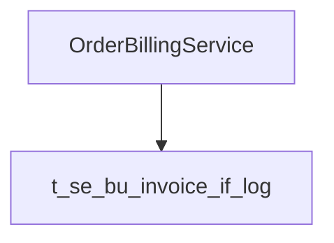

# WYSIWYG 装饰层实施计划

**日期**：2026-09-03  
**状态**：进行中  
**作者**：MonkeyCode-AI

## 项目概述

将 MarkLite 从双栏模式（源码 + 预览）改造为单栏幻觉编辑模式。保留 Markdown 作为唯一数据源，所有视觉增强通过 CodeMirror 6 装饰层实现。

## 前置条件

- Node.js 22+
- Rust 稳定版
- Windows 10 21H2+ (或 Linux 开发环境)
- WebView2 Runtime

## 任务列表

### Task 0: 环境准备

```bash
# 复制 MarkLite 源码到工作目录
cp -r /tmp/marklite-src/* /workspace/
cd /workspace
npm install
npm test
cargo test --manifest-path src-tauri/Cargo.toml
```

验证：现有测试全部通过。

---

### Task 1: 定义共享类型和配置扩展

**文件**: `src/lib/cm/types.ts`

```typescript
import type { RangeSet, Decoration } from "@codemirror/state";

export interface GutterItem {
  from: number;
  to: number;
  level?: 1 | 2 | 3 | 4 | 5 | 6;
  kind: 'heading' | 'list' | 'blockquote';
}

export interface StatusPayload {
  line: number;
  col: number;
  formats: Array<"bold" | "italic" | "code" | "aside" | "heading" | "list">;
  fenceLength?: number;
  rawSnippet: string;
  context?: string;
  asideHidden?: boolean;
  mediaError?: string;
}

export interface EntityHit {
  from: number;
  to: number;
  kind: 'class' | 'method' | 'table';
  content: string;
}

export interface AsideSpan {
  from: number;
  to: number;
  innerFrom: number;
  innerTo: number;
  content: string;
  overlong: boolean;
}

export type EntityIntensity = "aggressive" | "conservative";

export interface AppConfig {
  // 原有字段
  splitRatio: number;
  tocVisible: boolean;
  blockRemoteImages: boolean;
  window?: { x: number; y: number; w: number; h: number; maximized: boolean } | null;
  // 新增字段
  entityIntensity: EntityIntensity;
  entityBlacklist: string[];
}
```

**测试**: `src/lib/cm/types.test.ts`

```typescript
import { describe, it, expect } from "vitest";
import type { AppConfig, EntityIntensity } from "./types";

describe("AppConfig", () => {
  it("should include new entity fields", () => {
    const cfg: AppConfig = {
      splitRatio: 0.5,
      tocVisible: true,
      blockRemoteImages: false,
      entityIntensity: "aggressive",
      entityBlacklist: [],
    };
    expect(cfg.entityIntensity).toBe("aggressive");
    expect(Array.isArray(cfg.entityBlacklist)).toBe(true);
  });

  it("should fallback old config format", () => {
    const old = { splitRatio: 0.5, tocVisible: true, blockRemoteImages: false };
    const cfg: AppConfig = { ...old, entityIntensity: "aggressive", entityBlacklist: [] };
    expect(cfg.entityIntensity).toBeDefined();
  });
});
```

---

### Task 2: 实现实体识别扫描器 (entity-lex.ts)

**文件**: `src/lib/cm/entity-lex.ts`

```typescript
import type { EntityHit } from "./types";

const PASCAL_PATTERNS = [
  /[A-Z][a-z]+(?:[A-Z][a-z]+)+/,  // OrderBillingService
  /[a-z]+(?:[A-Z][a-z]+)+/,        // getUserById
];

const SNAKE_PATTERNS = [
  /(?:^|_)([a-z]+(?:_[a-z]+)+)/,   // t_se_bu_invoice_if_log
];

const TECHNICAL_VERBS = ["调用", "注入", "继承", "实现", "查询", "返回", "调用", "访问"];
const COMMON_SUFFIXES = ["Service", "Controller", "Mapper", "Utils", "DTO", "VO"];

function isContextual(text: string, from: number): boolean {
  const before = text.slice(Math.max(0, from - 30), from);
  return TECHNICAL_VERBS.some(v => before.includes(v));
}

function isCommonWord(word: string): boolean {
  const lower = word.toLowerCase();
  return ["the", "and", "for", "with", "from", "this", "that", "have"].includes(lower);
}

function hasCamelCase(word: string): boolean {
  return /[a-z][A-Z]/.test(word) || /[A-Z][a-z]/.test(word);
}

function hasUnderscore(word: string): boolean {
  return word.includes("_");
}

function isSnakeCaseMatch(word: string): boolean {
  const prefixMatch = /^(t_|v_|tmp_|tab_)/.test(word);
  const suffixMatch = /(_id|_log|_cfg)$/.test(word);
  return word.split("_").length >= 3 && (prefixMatch || suffixMatch);
}

export function scanEntities(
  text: string,
  intensity: "aggressive" | "conservative"
): EntityHit[] {
  const hits: EntityHit[] = [];
  const blacklist = new Set<string>();

  // 简单实现：匹配驼峰和下划线标识符
  const allMatches = text.match(/([A-Za-z][A-Za-z0-9_]+)/g) ?? [];
  
  for (const match of allMatches) {
    const from = text.indexOf(match);
    if (from === -1) continue;
    
    // 黑名单检查
    if (blacklist.has(match)) continue;
    
    // 跳过短词和常见词
    if (match.length < 6 || isCommonWord(match)) continue;
    
    let kind: "class" | "method" | "table" | null = null;
    
    // 驼峰识别
    if (hasCamelCase(match)) {
      if (match[0] === match[0].toUpperCase()) {
        kind = "class";
      } else {
        kind = "method";
      }
    }
    
    // 下划线识别
    if (hasUnderscore(match) && isSnakeCaseMatch(match)) {
      kind = "table";
    }
    
    // 上下文过滤
    if (kind && intensity === "aggressive" && !isContextual(text, from)) {
      kind = null;
    }
    
    if (kind) {
      hits.push({ from, to: from + match.length, kind, content: match });
    }
  }
  
  return hits;
}
```

**测试**: `src/lib/cm/entity-lex.test.ts`

```typescript
import { describe, it, expect } from "vitest";
import { scanEntities } from "./entity-lex";

describe("entity lex scanner", () => {
  it("should detect PascalCase class names", () => {
    const hits = scanEntities("OrderBillingService is a class", "aggressive");
    expect(hits.some(h => h.kind === "class" && h.content === "OrderBillingService")).toBe(true);
  });

  it("should detect snake_case table names", () => {
    const hits = scanEntities("t_se_bu_invoice_if_log is a table", "aggressive");
    expect(hits.some(h => h.kind === "table" && h.content === "t_se_bu_invoice_if_log")).toBe(true);
  });

  it("should not flag common words", () => {
    const hits = scanEntities("Apple is a company", "aggressive");
    expect(hits.some(h => h.content === "Apple")).toBe(false);
  });

  it("should respect blacklist", () => {
    const text = "OrderBillingService and Apple";
    const hits = scanEntities(text, "aggressive");
    // Apple should not be flagged even though it's capitalized
    expect(hits.some(h => h.content === "Apple")).toBe(false);
  });
});
```

---

### Task 3: 实现行内围栏状态机 (inline-fence.ts)

**文件**: `src/lib/cm/inline-fence.ts`

```typescript
import { EditorView, Decoration, WidgetType } from "@codemirror/view";
import { RangeSetBuilder } from "@codemirror/state";
import type { Extension } from "@codemirror/state";
import type { EntityHit } from "./types";

// 三态状态机
type FenceState = 'idle' | 'caretInBlock' | 'selected' | 'chipEdge';

interface FenceBlock {
  from: number;
  to: number;
  kind: 'bold' | 'italic' | 'code';
  state: FenceState;
}

function findFenceBlocks(text: string): FenceBlock[] {
  const blocks: FenceBlock[] = [];
  const regex = /(\*\*([^*]+)\*\*)|(\*([^*]+)\*)|(`([^`]+)`)/g;
  let match;
  
  while ((match = regex.exec(text)) !== null) {
    if (match[1]) {
      blocks.push({ from: match.index, to: match.index + match[1].length, kind: 'bold', state: 'idle' });
    } else if (match[3]) {
      blocks.push({ from: match.index, to: match.index + match[3].length, kind: 'italic', state: 'idle' });
    } else if (match[5]) {
      blocks.push({ from: match.index, to: match.index + match[5].length, kind: 'code', state: 'idle' });
    }
  }
  
  return blocks;
}

export function inlineFencePlugin(): Extension {
  return EditorView.decorations.compute(["doc"], (state) => {
    const text = state.doc.toString();
    const blocks = findFenceBlocks(text);
    const builder = new RangeSetBuilder<Decoration>();
    
    for (const block of blocks) {
      // idle 状态：隐藏标记，显示样式
      if (block.kind === 'bold') {
        builder.add(block.from, block.to, Decoration.mark({ 
          class: "cm-inline-bold",
          inclusive: false
        }));
      } else if (block.kind === 'italic') {
        // 中文检测
        const inner = text.slice(block.from + 1, block.to - 1);
        if (/[一-鿿]/.test(inner) && inner.length > 0) {
          builder.add(block.from, block.to, Decoration.mark({ 
            class: "cm-inline-italic-zh",
            inclusive: false
          }));
        } else {
          builder.add(block.from, block.to, Decoration.mark({ 
            class: "cm-inline-italic",
            inclusive: false
          }));
        }
      } else if (block.kind === 'code') {
        builder.add(block.from, block.to, Decoration.mark({ 
          class: "cm-inline-code-chip",
          inclusive: false
        }));
      }
    }
    
    return builder.finish();
  });
}
```

**测试**: `src/lib/cm/inline-fence.test.ts`

```typescript
import { describe, it, expect } from "vitest";
import { inlineFencePlugin } from "./inline-fence";
import { EditorState } from "@codemirror/state";
import { EditorView } from "@codemirror/view";

describe("inline fence plugin", () => {
  it("should decorate bold text", () => {
    const state = EditorState.create({
      doc: "**bold**",
      extensions: [inlineFencePlugin()]
    });
    const view = new EditorView({ state });
    const deco = view.state.facet(EditorView.decorations);
    expect(deco).toBeDefined();
    view.destroy();
  });

  it("should detect Chinese italic", () => {
    const state = EditorState.create({
      doc: "*中文强调*",
      extensions: [inlineFencePlugin()]
    });
    const view = new EditorView({ state });
    // 应该生成 cm-inline-italic-zh 装饰
    expect(view.state.facet(EditorView.decorations)).toBeDefined();
    view.destroy();
  });
});
```

---

### Task 4: 实现块级 Gutter (block-gutter.ts)

**文件**: `src/lib/cm/block-gutter.ts`

```typescript
import { EditorView, gutter, GutterMarker, Decoration } from "@codemirror/view";
import { RangeSetBuilder } from "@codemirror/state";
import type { Extension, StateField } from "@codemirror/state";

class HeadingGutterMarker extends GutterMarker {
  readonly text = "H2";
  readonly elementClass = "cm-gutter-heading";
  
  eq(other: GutterMarker): boolean {
    return other instanceof HeadingGutterMarker;
  }
  
  destroy(): void {}
}

class ListGutterMarker extends GutterMarker {
  readonly text = "•";
  readonly elementClass = "cm-gutter-list";
  
  eq(other: GutterMarker): boolean {
    return other instanceof ListGutterMarker;
  }
  
  destroy(): void {}
}

function getLineType(line: string): 'heading' | 'list' | 'blockquote' | null {
  if (/^#{1,6}\s/.test(line)) return 'heading';
  if (/^[-*]\s/.test(line)) return 'list';
  if (/^>\s/.test(line)) return 'blockquote';
  return null;
}

export function blockGutter(): Extension {
  return gutter({
    lineClass: (line) => {
      const type = getLineType(line.text);
      if (type === 'heading') return "cm-block-gutter-heading";
      if (type === 'list') return "cm-block-gutter-list";
      if (type === 'blockquote') return "cm-block-gutter-blockquote";
      return undefined;
    },
    renderLine: (line) => {
      const type = getLineType(line.text);
      if (!type) return null;
      
      const marker = type === 'heading' ? new HeadingGutterMarker() : new ListGutterMarker();
      return marker;
    }
  });
}
```

---

### Task 5: 实现旁白装饰 (aside-mark.ts)

**文件**: `src/lib/cm/aside-mark.ts`

```typescript
import { EditorView, Decoration } from "@codemirror/view";
import { RangeSetBuilder } from "@codemirror/state";
import type { Extension } from "@codemirror/state";
import type { AsideSpan } from "./types";

export function scanAsides(text: string): AsideSpan[] {
  const spans: AsideSpan[] = [];
  const regex = /\?\?([\s\S]*?)\?\?/g;
  let match;
  
  while ((match = regex.exec(text)) !== null) {
    const from = match.index;
    const to = from + match[0].length;
    const innerFrom = from + 2;
    const innerTo = to - 2;
    const content = match[1];
    
    spans.push({
      from,
      to,
      innerFrom,
      innerTo,
      content,
      overlong: content.length > 120
    });
  }
  
  return spans;
}

export function asideMarkPlugin(): Extension {
  return EditorView.decorations.compute(["doc"], (state) => {
    const text = state.doc.toString();
    const spans = scanAsides(text);
    const builder = new RangeSetBuilder<Decoration>();
    
    for (const span of spans) {
      // 隐藏围栏标记
      builder.add(span.from, span.innerFrom, Decoration.replace({ 
        class: "cm-aside-fence-hidden"
      }));
      builder.add(span.innerTo, span.to, Decoration.replace({ 
        class: "cm-aside-fence-hidden"
      }));
      
      // 修饰内部文本
      builder.add(span.innerFrom, span.innerTo, Decoration.mark({
        class: span.overlong ? "cm-aside-overlong" : "cm-aside",
        inclusive: false
      }));
    }
    
    return builder.finish();
  });
}
```

---

### Task 6: 实现状态栏探针 (status-probe.ts)

**文件**: `src/lib/cm/status-probe.ts`

```typescript
import { EditorView } from "@codemirror/view";
import { StateEffect, StateField } from "@codemirror/state";
import type { Extension } from "@codemirror/state";
import type { StatusPayload } from "./types";

export const setStatusPayload = StateEffect.define<StatusPayload>();

export const statusField = StateField.define<StatusPayload>({
  create() {
    return {
      line: 1,
      col: 1,
      formats: [],
      rawSnippet: "",
    };
  },
  update(value, tr) {
    value = tr.reduceState(value) ?? value;
    for (const effect of tr.effects) {
      if (effect.is(setStatusPayload)) {
        return effect.value;
      }
    }
    return value;
  },
  eventHandlers: {
    cursorDrop: (view, event) => {
      updateStatus(view);
    },
    selectionUpdate: (view) => {
      updateStatus(view);
    },
  },
});

function updateStatus(view: EditorView) {
  const { from, to } = view.state.selection.main;
  const line = view.state.doc.lineAt(from);
  const col = from - line.from + 1;
  
  const text = view.state.doc.toString();
  const snippet = text.slice(Math.max(0, from - 40), Math.min(text.length, to + 40));
  
  const payload: StatusPayload = {
    line: line.number,
    col,
    formats: [],
    rawSnippet: snippet,
  };
  
  view.dispatch({ effects: setStatusPayload.of(payload) });
}

export function statusProbePlugin(): Extension {
  return [statusField, EditorView.updateListener.of((update) => {
    if (update.selectionSet) {
      updateStatus(update.view);
    }
  })];
}
```

---

### Task 7: 扩展 AppConfig 和配置持久化

**文件**: `src/lib/types.ts`

```typescript
export interface AppConfig {
  window?: WindowGeom | null;
  splitRatio: number;
  tocVisible: boolean;
  blockRemoteImages: boolean;
  entityIntensity: "aggressive" | "conservative";
  entityBlacklist: string[];
}
```

**Rust 侧**: `src-tauri/src/commands.rs`

```rust
#[tauri::command]
pub fn get_config() -> Result<AppConfig, String> {
    // 现有实现，需要添加新字段的默认值
    Ok(AppConfig {
        window: None,
        splitRatio: 0.5,
        tocVisible: true,
        blockRemoteImages: false,
        entityIntensity: "aggressive".to_string(),
        entityBlacklist: vec![],
    })
}
```

---

### Task 8: 更新 App.svelte 单栏布局

**文件**: `src/App.svelte`

主要改动：

1. 删除分栏相关状态 (`sourceVisible`, `previewVisible`, `splitRatio`)
2. 替换预览宿主为编辑器宿主
3. 更新菜单（移除源码/预览开关，添加着色强度）
4. 更新状态栏

```svelte
<!-- 新的 workspace 结构 -->
<div class="workspace">
  {#if tocVisible}
    <aside class="toc" style="width:{tocWidth}px">
      <!-- TOC 内容 -->
    </aside>
  {/if}
  <div class="editor-full">
    <div class="editor-host" bind:this={editorHost}></div>
  </div>
</div>

<!-- 更新的状态栏 -->
<div class="status">
  <span class="path">{active?.path}</span>
  <span class="encoding">{encodingHint}</span>
  <span class="status-info" id="status-info"></span>
  <span class="char-count">{active ? `${active.text.length} 字符` : ''}</span>
</div>
```

---

### Task 9: 更新主题 CSS

**文件**: `src/app.css`

添加语义主题变量：

```css
:root {
  --mark-title: #1e2a3a;
  --mark-body: #2c3e50;
  --mark-entity-class: #d35400;
  --mark-entity-class-bg: rgba(211, 84, 0, 0.08);
  --mark-entity-method: #2980b9;
  --mark-entity-method-bg: rgba(41, 128, 185, 0.08);
  --mark-entity-table: #27ae60;
  --mark-entity-table-bg: rgba(39, 174, 96, 0.12);
  --mark-aside-text: #8e99a4;
  --mark-aside-bg: #fffbeb;
  --mark-aside-border: #fcd34d;
  --mark-code-fg: #e74c3c;
  --mark-code-bg: #f0f2f5;
  --mark-quote-border: #8e44ad;
  --mark-ghost-opacity: 0.25;
  --mark-ghost-size: 0.7em;
  --mark-selected-border: #3b82f6;
  --mark-emphasis-zh: #d35400;
}

@media (prefers-color-scheme: dark) {
  :root {
    --mark-aside-bg: #2d2a1a;
    --mark-entity-class: #e86a1a;
    --mark-entity-method: #3a9ad4;
    --mark-entity-table: #34c77c;
  }
}

/* 行内围栏样式 */
.cm-inline-bold {
  font-weight: 700;
  color: #1a1a1a;
}

.dark .cm-inline-bold {
  color: #e8e2dc;
}

.cm-inline-italic-zh {
  font-style: normal;
  color: var(--mark-emphasis-zh);
  font-weight: 500;
}

.cm-inline-code-chip {
  font-family: "JetBrains Mono", "Cascadia Code", monospace;
  background: var(--mark-code-bg);
  color: var(--mark-code-fg);
  border-radius: 4px;
  padding: 0 4px;
}

/* 旁白样式 */
.cm-aside {
  font-size: 14px;
  font-weight: 300;
  color: var(--mark-aside-text);
  opacity: 0.75;
  background: var(--mark-aside-bg);
  border: 1px dashed var(--mark-aside-border);
  padding: 2px 4px;
  border-radius: 2px;
}

/* 块级 Gutter */
.cm-block-gutter-heading {
  color: var(--mark-title);
}

.cm-block-gutter-list {
  color: #6b5a4e;
}
```

---

### Task 10: 更新 samples/kitchen-sink.md

```markdown
# MarkLite 验收样例

这是一个综合测试文档。

## OrderBillingService 类说明

`OrderBillingService` 是核心服务类，负责处理订单计费逻辑。

调用流程：OrderBillingService → t_se_bu_invoice_if_log

查询接口：

| 方法名 | 返回值 | 说明 |
|--------|--------|------|
| `processOrder` | `Result<Order>` | 处理订单 |
| `getUserById` | `Option<User>` | 按ID查询用户 |

### 旁白示例

以下是 ??无法访问，本机无 mysql?? 这样的旁白示例。

## 代码示例

```rust
fn main() {
    let service = OrderBillingService::new();
    service.process_order();
}
```

## 公式

$$E = mc^2$$

行内公式 $a + b = c$ 也是支持的。

## 图表


```

---

### Task 11: 运行测试套件

```bash
# 前端测试
npm test

# Rust 测试
cd src-tauri && cargo test --lib && cd ..

# 类型检查
npx tsc --noEmit
```

---

### Task 12: 提交变更

```bash
git add -A
git commit -m "feat: implement WYSIWYG decoration layer

- Add single-pane editor with CM6 decorations
- Implement entity highlighting (PascalCase, snake_case)
- Add ???aside??? support with磨砂glass effect
- Remove split view source/preview
- Update keyboard shortcuts and menus"
```

---

## 验收标准

1. 编辑器只有一栏，无预览窗
2. `**加粗**` 显示为粗体，不显示星号
3. `*中文*` 显示为茶褐色，不斜体
4. `` `代码` `` 显示为芯片样式
5. 驼峰类名显示琥珀橙
6. 下划线表名显示翠绿
7. `??旁白??` 显示为磨砂玻璃效果
8. 状态栏显示源码片段和格式信息
9. 原有编码、Dirty、保存功能正常工作
10. 所有现有测试通过

---

## 风险与注意事项

1. **性能**: 实体扫描需要在视口 ±100 行范围内，避免全文扫描
2. **兼容性**: 旧配置文件需要兼容新字段默认值
3. **测试覆盖**: 每个插件都需要单元测试
4. **打印**: `@media print` 需要隐藏所有装饰
