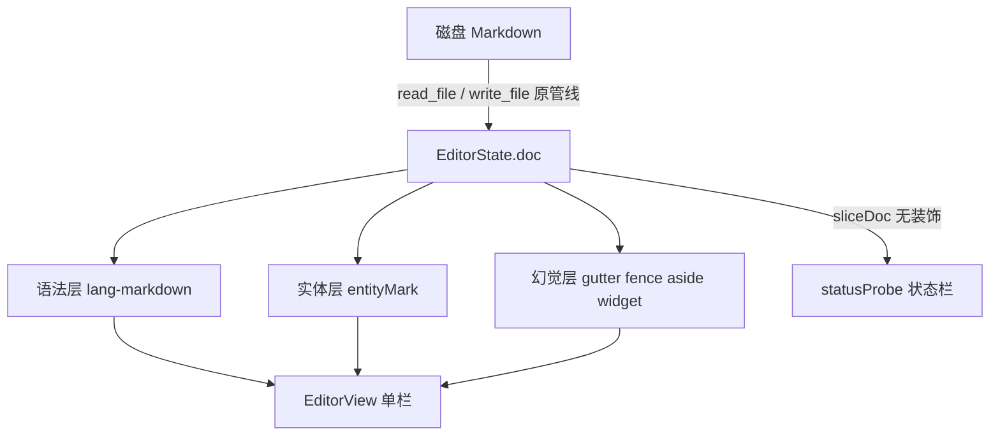

# MarkLite 单栏幻觉编辑：CM6 装饰层设计

Feature Name: wysiwyg-decoration-layer
Updated: 2026-09-03
Status: Draft pending user review

## 1. 问题与目标

当前 MarkLite 左右分栏（源码 + HTML 预览）迫使作者在「记号」与「效果」之间反复横跳。本设计取消分栏，只保留一栏 CodeMirror 6 编辑器：磁盘上仍是朴素 Markdown，视图上用 Decoration 把结构标记降级为控件、把行内标记降级为样式。

目标：

- 正文区只剩干净文字；`#`、`-`、`1.` 抽到左侧 gutter 控件。
- 行内 `**` / `*` / `` ` `` 按三态显隐，中文强调不使用斜体。
- 驼峰类名、下划线表名靠词法漏斗即时着色，不依赖反引号。
- `??旁白??` 以临时墨迹呈现，保存时围栏原样写回。
- 状态栏永远用 `sliceDoc` 暴露当前光标处的裸源码片段。
- 编码、BOM、换行、Dirty、单实例、文件关联、10 MiB 只读管线不变。

权威数据始终是 `EditorState.doc`。任何视觉层失败都不得改写或损坏 `doc`。

## 2. 明确不做

- 鼠标拖拽调整标题层级。只允许 gutter 转盘与 `Ctrl+Shift+ArrowUp/ArrowDown`。
- 所见即所得式吞并空格/换行。空白字符全部保留在 `doc` 中。
- 修改 Lezer Markdown AST，或在输入 `#` 后自动补空格。
- 把展示层做成 ProseMirror / TipTap / Milkdown / Vditor。
- PDF / 精美打印排版。打印菜单仍打开系统对话框；`@media print` 隐藏 gutter、幽灵符号、实体底色、Widget，只打出当前 `doc` 的等宽纯文本。不恢复 HTML 预览窗来排版打印。
- 云同步、协作冲突。
- `??旁白??` 嵌套解析。内部再出现的 `??` 视为正文。
- 把 `*` 中文强调改成书名号或着重号。只做茶褐着色，底层 `*` 保留。
- GitHub Alerts（`>[!WARNING]`）本轮不做。
- 「新建空白文档」、自动更新：沿用产品既有 Out of Scope。
- 恢复源码/预览分栏、同步滚动、独立 Preview HTML 管线。

## 3. 架构

### 3.1 总体



Rust IPC、编码、asset 协议、单实例保持不变。删除前端分栏、`renderPreview` 驱动的右侧 HTML、源码/预览同步滚动。TOC 作为可选左侧大纲保留：点击标题只滚动编辑器，不再同步预览窗。

### 3.2 三层滤镜顺序

1. **语法层**：`@codemirror/lang-markdown` + Lezer。只负责结构识别，不负责「好看」。
2. **实体层**：`StateField` + 视口增量正则，产出 `Decoration.mark`（`inclusive: false`）。
3. **幻觉层**：gutter 药丸/列表点、行内三态围栏、`??` replace、媒体 Widget。

三层都只读 `doc`，只通过 `EditorView.decorations` / `GutterMarker` 输出。保存、撤销、查找、大文件只读一律打在裸 `doc` 上。

### 3.3 必须打的三个补丁

1. **媒体 Widget 高度震荡**：异步渲染前先放 `min-height: 200px` 骨架；`ResizeObserver` 观察真实高度；完成后 `EditorView.requestMeasure()`，禁止滚动条抽搐。
2. **`??` 光标落脚**：`Decoration.replace` 抹掉围栏时配置 `inclusive: true`（或 `side: 1`），光标碰到隐形墙壁整体跳到括号外。状态栏仍高亮显示被藏的 `??`。
3. **撤销回温**：实体层 `StateField` 监听 `transaction.changes`。只要 `doc` 有增删改，无论视口变没变，重绘当前视口 ±100 行。不得只依赖 `viewportChanged`。

## 4. 组件

新插件全部放在 `src/lib/cm/`，由 `src/lib/editor.ts` 装配。互不改 `doc`。

| 插件 | 文件 | 职责 |
|---|---|---|
| `blockGutter` | `cm/block-gutter.ts` | 行首 ATX `#`、无序 `-`/`*`、有序 `1.` 抽到 gutter |
| `inlineFence` | `cm/inline-fence.ts` | 行内三态、中文强调覆盖、代码芯片、选中虚线框 |
| `entityMark` | `cm/entity-mark.ts` | 三层漏斗着色、邻色互抑、黑名单 |
| `asideMark` | `cm/aside-mark.ts` | `??…??` 磨砂、折叠、竣工清单数据 |
| `mediaWidget` | `cm/media-widget.ts` | mermaid / KaTeX / 本地图骨架与 `requestMeasure` |
| `statusProbe` | `cm/status-probe.ts` | 选区变化时产出 `StatusPayload` |
| `themeTokens` | `cm/theme.css` | 语义色与列表呼吸间距 |

`App.svelte`：去掉分栏、预览宿主、源码/预览开关；保留标签、菜单、TOC、状态栏、对话框。菜单增加「智能着色强度」与「清理施工现场」。

键盘（Windows 以 Ctrl 为主，同时监听 Meta）：

| 快捷键 | 行为 |
|---|---|
| Ctrl+B | 切换 `**` 加粗围栏 |
| Ctrl+I | 切换 `*` 强调围栏（中文仍茶褐，不斜体） |
| Ctrl+. | 选区包裹 / 解开 `??` |
| Ctrl+Shift+ArrowUp / ArrowDown | 当前标题行升降级 |
| Ctrl+Shift+E | 当前词加入实体黑名单 |
| Ctrl+Shift+Backspace | 删除当前围栏，保留内部文字 |
| Ctrl+F / Ctrl+S / Ctrl+W 等 | 沿用现有 |

## 5. 块级 gutter

### 5.1 标题

行匹配：`/^(#{1,6})[ \t]+/`。

- 行首的 `#` 序列与紧随的空白用 `Decoration.replace` 隐藏。
- gutter 显示淡蓝小药丸，文案 `H1`…`H6`。
- 正文使用对应标题字号、字重、色 `--mark-title`，H1–H3 带底边距。
- 单击药丸：弹出层级转盘 H1–H6 / 正文。选择后 `dispatch` 改写行首 `#` 数量（可撤销）。
- 光标在标题可见文本的第一个字符上按 Backspace：H2→H1→段落，不逐个删除隐藏的 `#`。

敲入：行首连续输入 `#` 并跟空格后，本行立刻进入标题幻觉；`#` 本身从正文流消失，药丸出现。

### 5.2 列表

无序：行首 `- ` 或 `* `（后随空白）隐藏，gutter 灰色圆点，与正文间距 4px。
有序：行首 `N. ` 隐藏，gutter 蓝色数字。
嵌套：按 Markdown 缩进计算层级，内容区额外 `padding-left: 2em` 每级（两个汉字宽），gutter 标记跟随层级缩进。

列表项 `line-height` 为正文的 1.6 倍；相邻 `li` 不加额外 margin，呼吸感只来自行高。

### 5.3 引用

行首 `>` 隐藏为左侧淡紫竖杠（`--mark-quote-border: #8E44AD`）。引用内容本身仍可套行内幻觉。

## 6. 行内围栏状态机

状态只对「光标/选区所在块」（通常是当前物理行，围栏跨行时为围栏范围）有效。其它行保持 `idle` 幻觉。

| 当前状态 | 触发 | 目标 |
|---|---|---|
| idle | `selection.main.head` 进入该块 | caretInBlock |
| caretInBlock | 块内选中 ≥ 2 个字符（`!selection.empty`） | selected |
| selected | 选区清空 | caretInBlock |
| caretInBlock | `head` 离开该块 | idle |
| selected 或 caretInBlock | 双击 `**` / `*` / `` ` `` 幽灵围栏边界 | chipEdge |
| chipEdge | Delete / Backspace，或浮动条「移除围栏」 | selected（围栏删除，文字保留） |
| chipEdge | 点击非围栏区域或 Escape | 进入 chipEdge 前的状态 |

### 6.1 idle（光标不在该块）

记号完全隐身，只留样式：

- `**加粗**`：字重 700，色 `#1A1A1A`（暗色主题改为近白）。
- `*强调*`：若内部 CJK 占比 > 80%，覆盖 Lezer Emphasis 为 `font-style: normal; color: #D35400; font-weight: 500`。否则保留斜体。
- `` `代码` ``：JetBrains Mono / Cascadia Code / Consolas 等宽，底 `#F0F2F5`，字 `#E74C3C`，圆角芯片。

### 6.2 caretInBlock

该块内所有行内记号以幽灵形式出现：不透明度 `--mark-ghost-opacity: 0.25`，字号 `--mark-ghost-size: 0.7em`，`vertical-align: super`，与文字之间不加空格。嵌套时粗体幽灵略深、强调幽灵更淡。

行内代码芯片边缘加灰色点状虚线。芯片内 Backspace 删到最后一个字符时，光标弹出到芯片右侧，反引号不删。拆除围栏必须双击边缘进入 `chipEdge`，或 `Ctrl+Shift+Backspace`。

Ctrl+点击已加粗/强调的文字：光标跳到「开头围栏与文字的夹缝」。

### 6.3 selected

被选中的格式化文本：1px 浅蓝虚线框（`--mark-selected-border`），四角微型手柄。拖动手柄只移动围栏在 `doc` 中的位置以扩展/收缩范围，可撤销。不用于标题层级。

浮动条显示人类可读包裹，例如 `** 加粗 **`。若用户删掉其中一个 `*`，虚线框闪橙色一次，提示格式即将断裂；不自动「修复」为错误的 AST。

### 6.4 未闭合围栏

Lezer 未识别为完整 mark 的零散 `*` / `**` / `` ` ``：不套样式、不隐藏。状态栏 `rawSnippet` 照常显示，避免幻觉与磁盘不一致。

## 7. 实体着色

着色发生在单词结束后的顿笔：空格、回车、中英文逗号句号之后约 150ms。扫描范围：当前视口 ±100 行。`transaction.changes` 非空则无条件重扫该范围。

`Decoration.mark` 一律 `inclusive: false`。已包在行内代码芯片内的 token 不再叠实体色。

### 7.1 形态

**PascalCase / camelCase**

- 长度 ≥ 6；至少 2 个大写或大小写交替。
- 后缀 `Service|Controller|Mapper|Utils|DTO|VO` 加权。
- 命中例：`OrderBillingService`、`getUserById`。
- 不命中：`Apple`、`Get`。

大驼峰（类/服务）：`--mark-entity-class` 琥珀橙，字重 600，底 1px 淡橙虚线。
小驼峰（方法/变量）：`--mark-entity-method` 海蓝，字重 400；hover 时右侧极小 `ƒ`。

**snake_case 表名**

- 至少 2 个 `_`。
- 前缀 `t_` / `v_` / `tmp_` / `tab_`，或后缀 `_id` / `_log` / `_cfg`。
- 命中例：`t_se_bu_invoice_if_log`。
- 不命中：`my_variable`。

样式：`--mark-entity-table` 翠绿，字重 500，底 `--mark-entity-table-bg`。

### 7.2 上下文

检查匹配左侧最多 3 个词。若存在中文技术动词（调用、注入、继承、实现、查询、返回），饱和度 +20%。若左侧像中文人名/地名且无技术动词，抑制着色。

### 7.3 语义锚

文档中某 PascalCase 一旦被形态+上下文命中，本标签后续所有相同字符串继承该类样式，即使出现在纯中文句子里。锚点随 `doc` 变化重算，不写入磁盘。

### 7.4 邻色互抑

同一行同时出现类色与表色时，两者饱和度各 -10%。

### 7.5 用户控制

状态栏滑块：

- **激进**（默认）：三层漏斗全开。
- **保守**：只对已在 `**` 或 `` ` `` 内部的 token 着色。

`Ctrl+Shift+E`：当前词写入 `config.entityBlacklist: string[]`，立即变回正文色，持久化到现有 `get_config` / `set_config`。

## 8. 旁白 `??…??`

匹配：`/\?\?([\s\S]*?)\?\?/g`，非嵌套、非贪婪。`from = match.index`，`to = match.index + match[0].length`，内部文本为 `match[1]`。

磁盘保留 `??`。视图：围栏 `Decoration.replace` 宽度为 0；内部 `Decoration.mark` 磨砂。

非编辑态：字号 -2px，字重 300，色 `--mark-aside-text`，不透明度 0.75，底 `--mark-aside-bg`，1px 虚线边 `--mark-aside-border` 只裹文字。左侧淡灰铅笔 CSS 图标（不使用 emoji 字符）。独占一行时上下边距为正常段落一半。

编辑态（光标进入该旁白）：底变为 `#FEF08A`，文字 `#374151`、正文字号；铅笔变橙；旁出三个动作：标记完成（删除整段含围栏）、转为正式正文（剥围栏留字）、删除备注符（同剥围栏）。

过长（单条 > 120 字或跨 3 行）：右侧灰竖条，双击折成可见的 `??...??`，悬停展开。

竣工模式：工具栏扫把打开旁白清单，列出全部 `??` 范围。批量：剥围栏留字 / 转为 `>` 引用 / 删除整段 / 导出为同目录 `TODO.md`（仅本地 `write_file`，不联网）。

快捷键 Ctrl+. ：选区无围栏则包裹，已在旁白内则剥开。

## 9. 媒体 Widget

围栏代码 `mermaid`、`$$` 块级公式、Markdown 图片在编辑器流内用 `WidgetType` 挂接，不另开预览窗。

光标与源码：

- 光标不在该围栏内（idle）：用 Widget 替换围栏可见区域，源码字符仍在 `doc` 中。
- 光标进入围栏（含围栏起始行的 \`\`\` / `$$`）：Widget 收到骨架高度以下，其上方展开可编辑源码；离开后再收起为 Widget。
- 不得用 `Decoration.replace` 把围栏源码宽度置零——媒体源码必须能被 caretInBlock 直接改。

生命周期：

1. 识别到节点 → 插入骨架 Widget（`min-height: 200px`，灰底）。
2. 异步渲染（沿用现有 KaTeX / mermaid 3 秒超时 / asset 图片规则）。
3. `ResizeObserver` + `requestMeasure()`。
4. 失败进入 `renderError`：粉红底 + 警告图标，状态栏暴露该行裸源码。`doc` 不变。

行内 `$…$` 用 mark/widget 插入公式，失败显示原 TeX。远程图仍受「阻止远程图片」开关约束。

## 10. 状态栏契约

监听 `selection` 变化，`sliceDoc` 截取光标所在格式节点（无则当前行，≤ 80 字符）：

```typescript
interface StatusPayload {
  line: number;
  col: number;
  formats: Array<"bold" | "italic" | "code" | "aside" | "heading" | "list">;
  fenceLength?: number;
  rawSnippet: string;
  context?: string;
  asideHidden?: boolean;
  mediaError?: string;
}
```

展示格式（系统等宽，无装饰字体）：

`Ln 24, Col 12 | 格式: **加粗** (围栏长度: 2) | 上下文: OrderBillingService`

标题行额外：`H2 - 整车销售开票`。
旁白行：`asideHidden: true`，snippet 中用浅橙标出被藏的 `??`。
`renderError`：追加 `媒体错误: <原因>`。

## 11. 数据格式

```typescript
type DecorationSet = RangeSet<Decoration>;

interface GutterItem {
  from: number;
  to: number;
  marker: GutterMarker;
  level?: 1 | 2 | 3 | 4 | 5 | 6;
}
```

实体/旁白/行内均产出 `RangeSet<Decoration>`。gutter 只占行首锚点，不改 `doc` 长度。

## 12. 语义主题

不硬编码散落色值，统一 CSS 变量。亮色默认：

```css
:root {
  --mark-title: #1e2a3a;
  --mark-body: #2c3e50;
  --mark-entity-class: #d35400;
  --mark-entity-class-bg: rgba(211, 84, 0, 0.08);
  --mark-entity-method: #2980b9;
  --mark-entity-method-bg: rgba(41, 128, 185, 0.08);
  --mark-entity-table: #27ae60;
  --mark-entity-table-bg: rgba(39, 174, 96, 0.12);
  --mark-aside-text: #8e99a4;
  --mark-aside-bg: #fffbeb;
  --mark-aside-border: #fcd34d;
  --mark-code-fg: #e74c3c;
  --mark-code-bg: #f0f2f5;
  --mark-quote-border: #8e44ad;
  --mark-ghost-opacity: 0.25;
  --mark-ghost-size: 0.7em;
  --mark-selected-border: #3b82f6;
  --mark-emphasis-zh: #d35400;
}
```

暗色：`--mark-aside-bg` 改为 `#2d2a1a`；琥珀橙/海蓝/翠绿饱和度 +15%；标题与正文改为浅灰白。跟随 `prefers-color-scheme`，与现有系统主题策略一致。

编辑器正文字色 `--mark-body`，标题 `--mark-title`。等宽链：`JetBrains Mono, Cascadia Code, Consolas, Microsoft YaHei Mono, monospace`。

## 13. 配置

扩展现有 `AppConfig`（仍走 `get_config` / `set_config`）：

```typescript
entityIntensity: "aggressive" | "conservative";
entityBlacklist: string[];
```

`splitRatio`、源码/预览可见性不再参与新 UI；读取旧配置时忽略未知字段，不报错。

## 14. 错误处理

| 情况 | 行为 |
|---|---|
| mermaid 语法错或 >3s | Widget `renderError`，doc 不变 |
| 图片 404 / 越界 | 同 `renderError`，沿用现有占位文案 |
| KaTeX 失败 | 该处显示原 TeX + 短错误 |
| 实体正则耗时 | 仅视口 ±100 行；超时则跳过本帧，下次 changes 再扫 |
| 未闭合 `**` | 不装饰 |
| 写入失败 | 现有 Dirty 与错误对话框，与装饰层无关 |
| >10 MiB 只读 | 不启用幻觉层与实体层，纯文本只读（沿用现有） |
| >2 MiB | 幻觉层仅处理视口，禁止全文档 Decoration 重建 |

## 15. 测试

Vitest + `@codemirror/state` 无头测试，不依赖 GUI。

- 实体：命中 `OrderBillingService` / `t_se_bu_invoice_if_log`；不命中 `Apple` / `Get` / `my_variable`。
- 中文强调：`*接口返回*` CJK>80% → 茶褐且非 italic。
- 旁白：`??a??` 范围为整段含围栏；`??a??b??` 不把后一个当嵌套。
- 标题升降级：H2↔H1↔段落，一次 dispatch 可撤销。
- 芯片 Backspace：删至空字符不删除反引号。
- `statusProbe`：光标在 `**加粗**` 内，`rawSnippet` 含星号，`fenceLength === 2`。
- 实体 `changes`：模拟撤销后装饰集合与新 doc 对齐。
- 现有 `preview.test.ts` 中仅被打印/导出需要的净化用例若删除预览管线，则改为测试「打印 CSS 隐藏装饰」的静态约定；GFM 渲染断言迁到 Widget 输入识别（围栏语言、公式分隔符），不再对 HTML 快照负责。

Rust 单测不因本功能新增。

## 16. 对现有代码的影响

删除或停止引用：`src/lib/preview.ts` 作为窗口右侧 HTML 的调用路径、`sync-scroll.ts` 的双栏逻辑、`App.svelte` 中预览宿主与分栏拖条。

保留：`read_file` / `write_file` / 编码 / TOC 提取（可继续用 markdown-it 或改为扫描 ATX 行）/ 查找 / 打印降级 / kitchen-sink 样例。`samples/kitchen-sink.md` 增补：驼峰类名、表名、`??旁白??`、中文 `*强调*`。

菜单「视图」去掉源码/预览开关，保留 TOC、远程图、着色强度。
