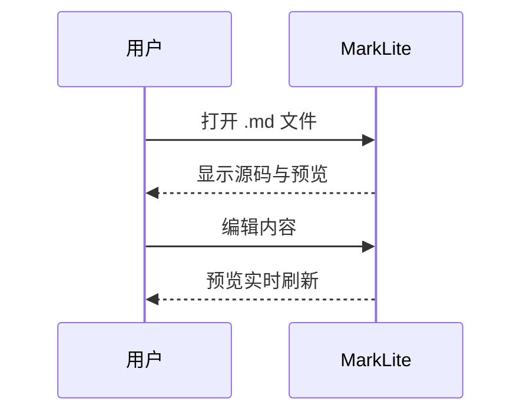

# MarkLite 验收样例

这是用于离线验收的 Sample Document。

## Setext 二级

这段下面是 Setext 标题。

表格
====

| 列 A | 列 B |
| --- | --- |
| 1 | 2 |
| 3 | 4 |

## 任务与删除线

- [x] 已完成项
- [ ] 未完成项

这是 ~~删除线~~ 与自动链接 https://example.com 。

脚注引用。[^note]

[^note]: 脚注定义。

## 代码高亮

```bash
echo hello
```

```javascript
const x = 1;
```

```js
const y = 2;
```

```typescript
const z: number = 3;
```

```ts
const w: string = "ok";
```

```json
{ "ok": true }
```

```python
print("hi")
```

```go
package main
func main() {}
```

```rust
fn main() {}
```

```html
<div class="x">hi</div>
```

```css
.x { color: teal; }
```

```yaml
name: marklite
```

```sql
SELECT 1;
```

```markdown
# inner
```

```not-a-lang
plain fence
```

## 公式

行内公式 $E=mc^2$ 在段落中。

$$
\int_0^1 x^2 \, dx = \frac{1}{3}
$$

## 图表


时序图：



## 图片

本地相对路径：


远程图（有网时显示，断网占位）：


## 安全

<script>alert(1)</script>

<a href="javascript:alert(1)">脚本链接</a>


