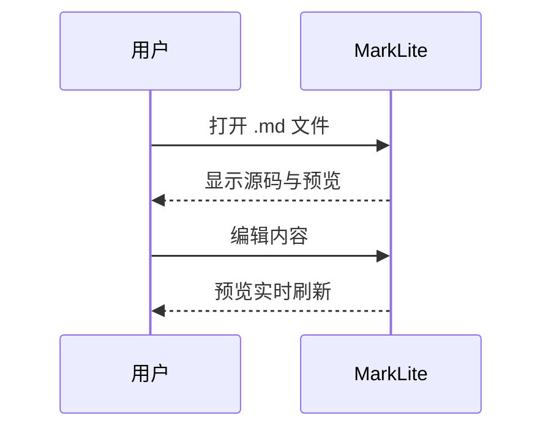

# MarkLite 验收样例

这是用于离线验收的 Sample Document。

## Setext 二级

这段下面是 Setext 标题。

表格
====

| 列 A | 列 B |
| --- | --- |
| 1 | 2 |
| 3 | 4 |

## 任务与删除线

- [x] 已完成项
- [ ] 未完成项

这是 ~~删除线~~ 与自动链接 https://example.com 。

脚注引用。[^note]

[^note]: 脚注定义。

## 实体着色

驼峰类名（琥珀橙）：`OrderBillingService` 继承自 `AbstractPaymentController`。

表名下划线（翠绿）：查询 `t_se_bu_invoice_if_log` 表中的 `_id` 字段。

方法海蓝：调用 `getUserById()` 返回 `PaymentDTO` 对象。

旁白（磨砂玻璃）：??这是编辑器的旁白注释，解释上面的逻辑??。

行内围栏：用 `code` 包裹代码片段，**粗体**强调重点，*中文强调*不改斜体。

## 代码高亮

```bash
echo hello
```

```javascript
const x = 1;
```

```typescript
const z: number = 3;
```

```python
print("hi")
```

```go
package main
func main() {}
```

## 公式

行内公式 $E=mc^2$ 在段落中。

$$
\int_0^1 x^2 \, dx = \frac{1}{3}
$$

## 图表


时序图：



## 图片

本地相对路径：


远程图（有网时显示，断网占位）：


## 安全

<script>alert(1)</script>

<a href="javascript:alert(1)">脚本链接</a>


